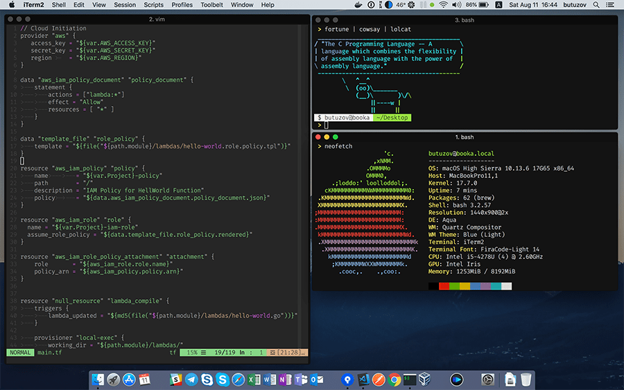

### dotfiles

```bash
git clone https://github.com/butuzov/.dotfiles ~/.dotfiles
cd ~/.dotfiles && ./activate
```

### High Sierra



P.S.
Background temporary set to #000 to match title bar (glitch on HighSierra). `vim` shows true background and titlebar color.
